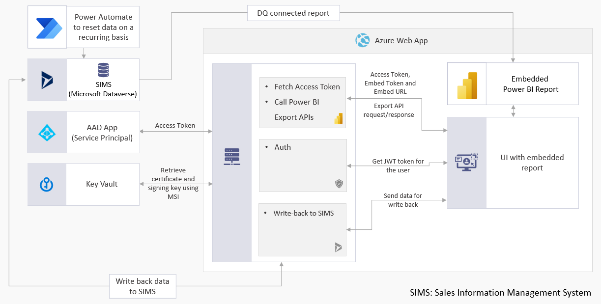

[Contoso Sales Demo](https://contososalesdemo.azurewebsites.net/) is an application based on Power BI [embedded analytics](https://aka.ms/powerbi-embedded), demonstrating a sales management portal. The application empowers salespeople and sale managers to make business decisions based on data. Salespeople can monitor and track sales, leads, opportunities and accounts, and manage their calendars. Sales managers can view a summary of the salesforce performance, including sales history and individual accounts. The application also enables managers to provide salespeople with data driven insights, assisting them with their decision making.

Follow the steps below to get a first hand experience of the demo:
1. Open the [Contoso Sales Demo](http://contososalesdemo.azurewebsites.net/) application.
2. Select **Salesperson**.
3. Select **Enter in demo mode**. 

This will log you in as an anonymous user in the role of a salesperson, allowing you to use the app in read-only mode.

## Embedded analytics features

This section lists the embedded analytics features demonstrated by the *Contoso Sales Demo* application.

### UI features

Users can do the following in the application’s user interface:

* Show/hide visuals.

* Change the layout of report visuals.

* Enable or disable Q&A support in the report.

* Apply custom themes to the embedded report, during runtime.

### Functionality

*Contoso Sales Demo* functionalities based on embedded analytics:

* Exporting reports to PDF, PPT and PNG formats.

* Showing edit options in the visual context menu.

* Binding custom actions to button clicks.

* Editing (insert/update) data in a table using writeback operations. In the *Contoso Sales Demo* application you can add data to a database directly from the UI.

* Service principal based authentication. This authentication method is recommended for accessing Power BI and [Microsoft Dataverse](https://aka.ms/microsoft-dataverse) REST APIs.

### Integration

*Contoso Sales Demo* integration with other Microsoft databases and libraries:

* Microsoft Dataverse. The application’s integration can be extended to other databases.

* [MSAL.NET](https://aka.ms/MSAL) used for service principal authentication.

## Prerequisites

### Cloud resources

|Azure|Power BI|Microsoft Dataverse|
|-----|--------|---|
|[App Service](https://aka.ms/AppService) for hosting the application    [Key Vault](https://aka.ms/AzureKeyVault) for storing certificates/secrets    [Azure AD](https://aka.ms/AzureAd) app for creating a [service principal](https://aka.ms/embed-service-principal-certificate) object    [Application Insights](https://aka.ms/app-insights-overview) for telemetry|[Power BI service license](https://powerbi.microsoft.com/en-us/pricing) for hosting reports    [Power BI Embedded capacity](https://aka.ms/powerbi-embedded-pricing) for embedding report|[Dynamics 365 license](https://aka.ms/dynamics365) for using Microsoft Dataverse as a data source|

## Power BI report
The report [ContosoSalesDemo.pbix](ContosoSalesDemo/PowerBIReport/) can be used as a reference for development.  
**Note:** This report is connected to a cached datasource using import mode.  
**Note:** As this report is not connected to a Microsoft Dataverse database using Direct Query, it will not support writeback functionality.

## Architecture

### Software Dependencies

|Client-side|Server-side|
|-----------|-----------|
|[React](https://reactjs.org/)   [TypeScript](https://www.typescriptlang.org/docs/)|[.NET 5](https://dotnet.microsoft.com/download/dotnet/5.0/)|

### SDK/ API references

|Power BI|Microsoft Dataverse|
|--------|---|
|[Power BI SDK](https://github.com/microsoft/PowerBI-CSharp)|[Create table](https://aka.ms/cds-create-entity-web-api)   [Update table](https://aka.ms/update-delete-entities-using-web-api)|

### Browser support

* Microsoft Edge

* Google Chrome

## Contributing

This project welcomes contributions and suggestions. Most contributions require you to agree to a Contributor License Agreement (CLA) declaring that you have the right to, and actually do, grant us the rights to use your contribution. For details, visit
https://cla.microsoft.com.

When you submit a pull request (PR), a CLA-bot will automatically determine whether you need to provide a CLA and tag the PR appropriately (using functions such as label or comment). Simply follow the
instructions provided by the bot. You will only need to do this once across all repositories using our CLA.

This project has adopted the [Microsoft Open Source Code of Conduct](https://opensource.microsoft.com/codeofconduct/). For more information see the [Code of Conduct FAQ](https://opensource.microsoft.com/codeofconduct/faq/), or contact [opencode@microsoft.com](mailto:opencode@microsoft.com) with any additional questions or comments.

## License
This project is licensed under the MIT license, see [LICENSE](./LICENSE.txt).